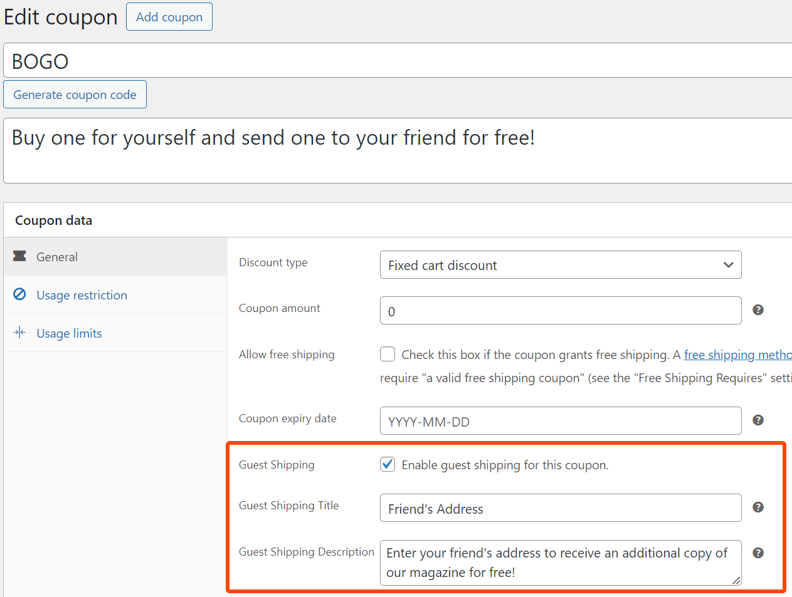

# RS WooCommerce Guest Shipping Coupons

This plugin extends WooCommerce coupons to support "Guest Shipping" address at checkout. Useful for promotions that require a separate shipping address.

## Required Plugins

* WooCommerce

## How to use

1. Install and activate the plugin
2. Edit a coupon in WooCommerce and enable the new "Guest Shipping" option
3. Test by adding the coupon to your cart. The checkout page should show a new "Guest Shipping" section.
4. After purchase, check your order for a new "Guest Shipping Address" section that appears near the Billing and Shipping addresses.

### 1.0.0

* Initial release
